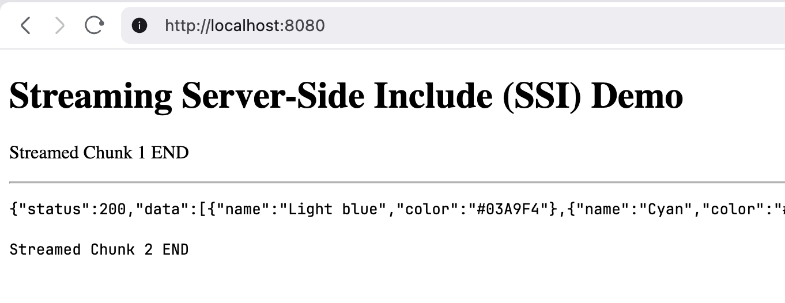
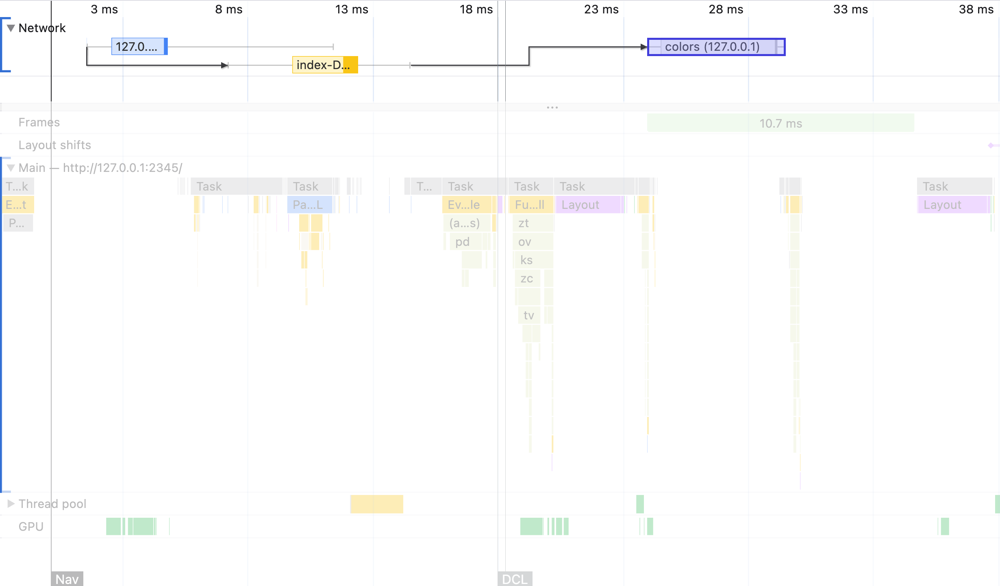
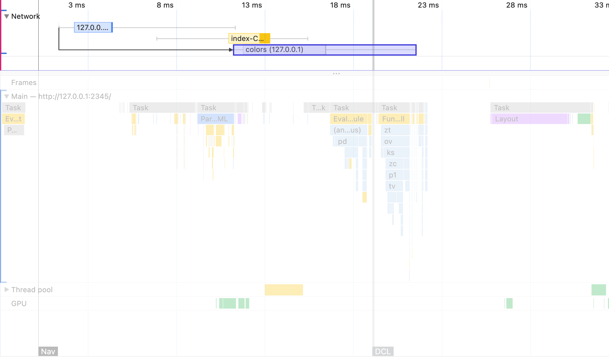

# Ahead of Time Fetch Demo for SPAs

Single Page Applications (SPAs) have a reputation for being slow. On the
first load, since its static assets are not cached yet, the browser has to download
them before they can start fetching data from the backend.

This repo shows a few ways to initiate backend API requests before the static 
JavaScript executes, so we can speed up rendering.


## Option 1: Server-Side Link header with preload
On the server side, you could add a `Link` header when sending the HTML document:
```
Link: </api/colors>; rel=preload; as=fetch; crossorigin=use-credentials
```

There is a working example in the Mockaton repo, see:
https://github.com/ericfortis/mockaton/blob/main/src/DashboardHtml.js#L36

That file generates the Link header payload for the initial data from the
API, but also for preloading static assets. In that example, `crossorigin` is
empty, which is required for preloading fetch requests, but it doesn’t have
`use-credentials` because it’s just a localhost app, which has no session cookie.


## Option 2: Server-Side Include (SSI) critical data
When serving the HTML document, you could stream it in two parts.
The document as is, and a second chunk with e.g., the JSON payload 
in a script tag. Then, on the client, [option2/spa.js](option2/spa.js), we
subscribe to an event that is triggered when the data is loaded.

See [option2/](./option2) directory:

```sh
cd option2
./server.js
```




## Option 3: Client-Side cached fetch
This option could be handy if you need a client-side only solution. For instance,
[my project](https://uxtly.com) is statically served from Nginx, so Option 2
is more work in my case. Similarly, Option 1 is not straightforward because I
conditionally prefetch an API based on a value in the user’s `localStorage`.


### TL;DR

Hold a reference to the fetch promise(s) you need. For example, in `index.html`:
```html
<html>
<head>
  <script type="module" src="script-958c.js"></script>
  <script>
    window._aotFetch = { 
      '/api/colors': fetch('/api/colors', /* credentials */) 
    }
  </script>
  <link rel="stylesheet" href="goes-after-aot-fetch.css" />
</head>
<body>
</body>
</html>
```

Then, await that promise in your SPA.

```js
const response = await window._aotFetch['/api/colors']
if (response.ok) 
  setColors(await response.json())
```


[src/App.jsx](./src/App.jsx) has a nicer example with a helper function.


## Background

`<script type="module">` or `<script defer>` don’t block, so the inline
`<script>` we added executes right away.

On the other hand, `<link rel="stylesheet" …>` do block, so it needs
to be placed after the aot inline script.


## Demo

```shell
git clone https://github.com/ericfortis/aot-fetch-demo.git
cd aot-fetch-demo
npm install 

npm run backend
npm run dev # in another terminal 
```

The following screenshots are from a built SPA
because the graphs are cleaner. If you prefer this approach, you can:
```sh
npm run build
npm run backend
```
Then, open http://localhost:2345


### Without AOT
In this screenshot, we haven’t injected the [inline script](./index-aot-fetch.js), so
you can see that `GET /api/colors` starts only after the SPA is ready.



---
<br/>

### With AOT



---
<br/>

## Setup (Vite)
Our [vite.config.js](./vite.config.js) has an `htmlPlugin` function 
that injects `index-aot-fetch.js` into `index.html`.


## Setup (Webpack)
This repo doesn’t include a Webpack setup, but you could do it like this:
```js
import HtmlWebpackPlugin from 'html-webpack-plugin'

// config
plugins: [
  new HtmlWebpackPlugin({ templateContent: htmlTemplate() })
]
```

```js
import { readFileSync } from 'node:fs'

export const htmlTemplate = () => `<!DOCTYPE html>
<html>
<head>
  <script>${readAotFetch()}</script>
  <link rel="stylesheet" … />
</head>
<body>
…
</body>
</html>`

function readAotFetch() {
  return readFileSync('./index-aot-fetch.js', 'utf8').trim()
}
```


## License

[MIT](LICENSE) © 2025 Eric Fortis


