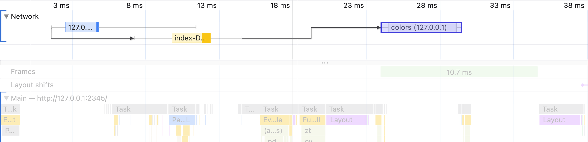
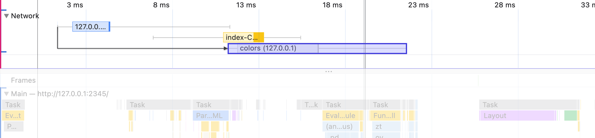
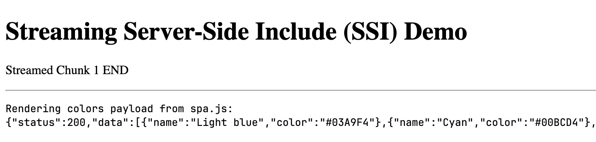

# Ahead of Time Fetch Demo for SPAs

This repo shows a few ways to speed up the cold start of SPAs.

_Cold start_ meaning either the initial load, or a version update. On subsequent
(warm) loads this technique is not needed because static assets can be fully cached.

<details>
<summary>About long-term caching and pre-compression…</summary>

### Long-term caching
For long-term caching, the quick win is versioning static
filenames (e.g., `script-<hash>.js`) and serving them with a
cache header with an `immutable` flag, which avoids revalidation:

```
Cache-Control: public,max-age=31536000,immutable
```

### Pre-compression

Another win is precompressing static assets. That way, you
can use the highest compression profile, which is discouraged
when compressing on-the-fly. For example, for brotli compression:

```sh
brotli --best my-file.js
```
That command outputs `my-file.js.br`, so e.g., with Nginx, you can
use the [brotli static module](https://github.com/google/ngx_brotli), which
will look for a file with that extra `.br` extension.

```nginx
location /assets {
  #…
  brotli_static on;
  add_header Cache-Control "public,max-age=31536000,immutable";
}
```
</details>


## Background

Most Single Page Applications (SPAs) initiate all backend requests from a static
JavaScript file. In those cases, that static file needs to be downloaded before initiating
API requests. **But that chain doesn’t have to be sequential**. We can concurrently
request dynamic APIs and static assets APIs without server side rendering (SSR).

In this repository we discuss two techniques. Option 1 is
client-initiated, while Option 2 is similar to a server side include (SSI).

- Option 1 is about indicating which APIs we want to preload. 
- Option 2 streams a chunk with only the API data, so there’s no rendering overhead.


## Option 1 - Overview
We’ll discuss four alternatives for this option. Three for preloading APIs with
[Links](https://developer.mozilla.org/en-US/docs/Web/HTML/Reference/Elements/link),
and fourth one for preloading with `fetch()`. Their performance difference
is negligible &mdash; they all start right after downloading the HTML
document. On the other hand, Option 2 has a potential, but slight, advantage
because it can initiate the API call before the HTML is sent. At any rate,
it’s pretty negligible because these HTML files are like 1.5 kB. Also, because
the requests reuse the TCP connection, so there’s no handshake overhead.


#### Without Ahead-of-Time (AOT)
In this screenshot, we do not use an AOT fetch technique, so you
can see that `GET /api/colors` starts only after the SPA is ready.



---
<br/>

#### With AOT
On the other hand, here’s what AOT fetch looks like. Note
the `index.html` and the API request download concurrently.




<br/>


### Option 1-A: Link header
Add a `Link` header when sending the HTML document. For example,
if you use Nginx to serve your `index.html`, you can:
```nginx
add_header Link '</api/colors>; rel=preload; as=fetch; crossorigin=use-credentials';
```

### Option 1-B: Add a &lt;link> to your `index.html`
Add a link tag:
```html

<head>
  <link rel="preload" href="/api/colors" as="fetch" crossorigin="use-credentials">
  …
</head>
```

### Option 1-C: Dynamically inject a &lt;link>
This is similar to 1-B, but it’s injected with an inline script. I use
this option in [my project](https://uxtly.com) because I conditionally
prefetch APIs based on a value in the user’s `localStorage`.

```html
<html>
<head>
  <script type="module" src="script-123 does not block because is type module.js"></script>
  
  <script>
    preload('/api/colors')

    function preload(url) {
      const link = document.createElement('link')
      link.as = 'fetch'
      link.rel = 'preload'
      link.href = url
      link.crossOrigin = 'use-credentials'
      document.head.appendChild(link)
    }
  </script>

  <link rel="stylesheet" href="style-123 blocks so it goes after preloading.css" />
</head>
<body>
</body>
</html>
```

#### Demo

```shell
git clone https://github.com/ericfortis/aot-fetch-demo.git
cd aot-fetch-demo
npm install 

npm run backend
npm run dev # in another terminal 
```

The screenshots above are from a built SPA because the
[performance-tab](https://developer.chrome.com/docs/devtools/performance) graphs
are cleaner that way. If you prefer this approach, you can run this instead:
```sh
npm run build
npm run backend
```

Then, open http://localhost:2345


#### Setup (Vite)
The [vite.config.js](./vite.config.js) of this repo has an `htmlPlugin` function
that injects [index-aot-fetch.js](./index-aot-fetch.js) into [index.html](./index.html).


#### Setup (Webpack)
This repo doesn’t include a Webpack setup, but you could do it like this:
<details>
<summary>Webpack setup</summary>

```js
import HtmlWebpackPlugin from 'html-webpack-plugin'

// config
plugins: [
  new HtmlWebpackPlugin({ templateContent: htmlTemplate() })
]
```

```js
import { readFileSync } from 'node:fs'

export const htmlTemplate = () => `<!DOCTYPE html>
<html>
<head>
  <script>${readAotFetch()}</script>
  <link rel="stylesheet" … />
</head>
<body>
…
</body>
</html>`

function readAotFetch() {
  return readFileSync('./index-aot-fetch.js', 'utf8').trim()
}
```
</details>

<br/>


### Option 1-D: Hold a reference to a promise

This is what I used to do before knowing about `rel=preload; as=fetch`, but I reckon
it could be useful if you need to include custom headers. For example:
```html
<html>
<head>
  <script type="module" src="script-123-does-not-block-because-is-module.js"></script>
  <script>
    window._aotFetch = { 
      '/api/colors': fetch('/api/colors', /* custom headers */) 
    }
  </script>
</head>
<body>
</body>
</html>
```

Then, await that promise in your SPA.

```js
const getColors = () => aotFetch('/api/colors')

function aotFetch(url) {
  if (window._aotFetch?.[url]) {
    const promise = window._aotFetch[url]
    delete window._aotFetch[url]
    return promise
  }
  return fetch(url, /* custom headers */)
}
```

### Related Articles
- https://oliverjam.es/articles/preload-data
- https://martinfowler.com/articles/data-fetch-spa.html#prefetching 
- https://developer.mozilla.org/en-US/docs/Web/HTML/Reference/Attributes/rel/preload#cors-enabled_fetches


<hr/>   
<br/>

## Option 2: Data-only Server Side Includes (SSI)

This technique is similar to SSR, but it avoids the rendering overhead.
It just streams the API data, commonly as JSON but not limited to it.

The demo streams `index.html` document in two parts.
The document as is, and a second chunk with the API response
in a script tag. Then, on the client ([option2/spa.js](option2/spa.js)), we
subscribe to an event that is triggered when the data is loaded.

See the [option2/](./option2) directory, you can run the demo with:

```sh
cd option2
./server.js
```




<br/>


## License

[MIT](LICENSE) © 2025 Eric Fortis


